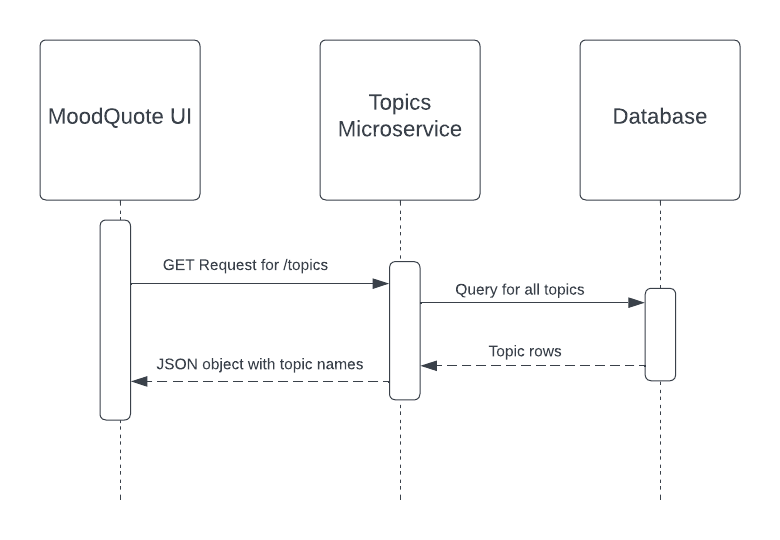

**A. How to Request Data**

Send a GET request to the endpoint /topics.

For example, If you are running the service locally, you can request this by typing localhost:4000/topics.

---
**B. How to Receive Data**

After sending the GET request, you will receive a JSON object that contains an array of topic names in the format:

```
{"topics": ["Topic1", "Topic2", "Topic3"]}
```

---
**C. UML Sequence Diagram**


